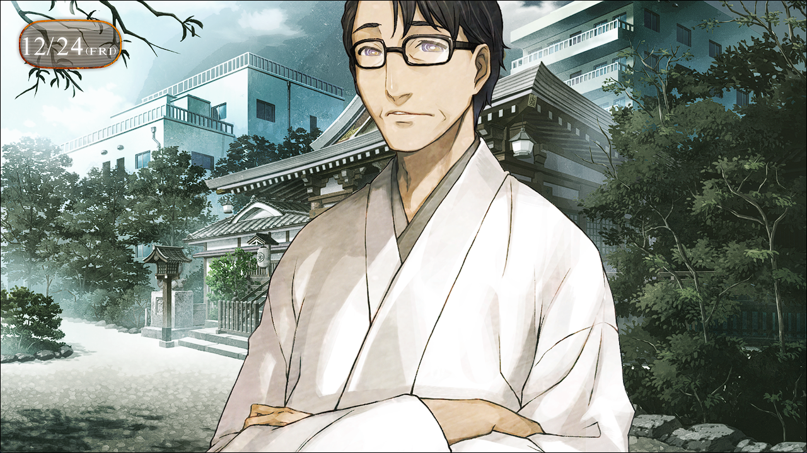

> <big> **轨道秩序的日蚀 - 02** </big>  
> 1.064750  
> [ 2010/12/24 ] 冈伦和真由理去神社看望篝，琉华父亲拜托二位女性在新年来帮忙当巫女。

这是琉华子把篝带到LAB后的第二天。穿过浓厚圣诞氛围中的秋叶原街，我和真由理一起前往柳林神社。  
“啊，真由理酱！还有冈部先生！”  
还没来得及打招呼，琉华子就发现了我们，绽放笑颜。那是可爱得完全不像是男人的、事到如今还会让人怀疑他性别的笑颜。  
“琉华君、篝酱，嘟嘟噜~”  
“呵呵，嘟嘟噜~desu。”  
“哇，篝酱，好棒！”  
“诶？什么？”  
“因为，就算真由氏说嘟嘟噜~，一开始大家都不肯用嘟嘟噜~回我呢。”  
“要求初次见面的人理解这是打招呼也太苛刻了。”  
“嗯。所以明明大家的反应都是‘那是啥？’，篝却很正常地回复了我，真的好棒！”  
“我、我也没特别……只是莫名觉得应该是那样吧。”  
说不定真由理独特的招呼已经深深烙在了篝的记忆中。嗯？也就是说……25年后的真由理还在说着嘟嘟噜吗？嘛，不愧是真由理，也不是什么奇怪的事。  
“啊，冈部先生也，嘟嘟噜~desu。”  
“你好……”
话说回来，我现在还在烦恼要用什么态度对她。她和铃羽分别时是10岁。之后过了12年，现在应该是22岁。年龄上比我年长，但又是真由理的养女。从这种意义上，立场和桶子的女儿铃羽是相同的。铃羽姑且和我们同岁，就算不用敬语也没有违和感……  
“啊，对了。今天是圣诞夜呢，圣诞快乐~”  
“说来是呢。圣诞快乐。”  
“圣诞快乐，desu。”  
说到底，在神社庆祝圣诞合适吗？
“话说回来，那个……篝，身体……怎么样了？”  
“不算差。只是……还什么也……”  
“不，关于记忆不用勉强去想。时间到了自然会恢复，保持这种心态就好了。”  
“知道了。”  
不过本人应该是想尽早恢复吧。
“……”  
“怎么了吗？”  
“没。只是觉得琉华君、真由理酱、还有冈部先生，大家都很温柔。”  
“哪有……我怎么可能温柔。”  
“呵呵，明明不用害羞的。”  
从见面起就无精打采的篝，第一次看到了她的笑容。感觉那笑容很孩子气，比理论年龄要年轻许多。  
“啊，对不起。我真是的，突然这么自来熟……”  
“不，没关系的。我也没有用敬语说话。”  
“是呀~真由氏也觉得普通地说话更开心~因为那样才更有好朋友的感觉呀~”  
“好朋友……”  
“嗯！好朋友。”  
“谢谢你，真由理酱。嘿嘿，好朋友啊……”  
说不定未来世界的真由理也是这么和她处好关系的。战争孤儿……铃羽是这么说的。那也全是——我的错吧。如果我走了铃羽所希望的路，篝也不会有那样的人生了吧。但为此我又要——  
“冈部先生，没事吧？感觉你脸色好像不是很好。”  
“啊、啊啊……没事。只是有点睡眠不足。”  
“是……这样吗。那就好……”  
“话说琉华子你刚才在做什么？感觉很忙的样子……”  
“在做本殿的扫除。”  
“扫除不是一直在做吗？”  
感觉每次来琉华子都拿着竹帚在打扫。  
“今天是大扫除，平时扫不到的地方也要扫。”  
“啊啊，是吗。确实快<abbr title="日语“お新年”，新年，从公历1月1日开始">新年</abbr>了。”  
对神社来说，新年是个重要的日子。  
“前天也扫过落叶了，但还有些剩下的地方，所以让篝也来帮忙了。”  
“光受照顾也不好意思，至少要稍微做些事。”  
琉华子和篝两人，手脚好像都相当麻利。  

“哦呀，琉华，有客人吗？”  
“啊，爸爸。”  
琉华父亲从本殿露面了。虽然脸看起来很和善，但我知道这是个相当有癖好的人物，主要和桶子是一个方向的。让琉华子穿巫女装帮忙，也都是这个人的指使。  
“哦呀，这不是冈部君和真由理酱吗。圣诞快乐。”  
“圣诞快乐。”  
……不，您是不应该说这句话的吧。  
“哦呀，有什么问题吗，冈部君？”  
“没有……”  
嘛，本人觉得可以的话我也没理由说什么。对了，我还要就篝的事情向他道谢。  
“那个……其实关于这个女孩……”  
“听琉华说是叫篝吧。没想到你们居然认识，世界真是小。”  
“是的。所以，那个……若能让她在贵府再待一段时间，我们会很感激的……”  
“看来是有什么原因啊。当然，我们家是非常欢迎的。”  
“非常感谢。”  
“谢谢叔叔。”  
“哈哈哈，不用谢。我也像有了新女儿一样高兴呢。”  
“‘像’有了……爸爸，不是有姐姐了吗？”  
“那孩子完全不回家啊。知道我怕寂寞还故意使坏。”  
“啊哈哈……”  
“对了，我想到个好主意。难得这么多女孩聚在一起，要不要新年时来神社里帮忙？”  
“帮忙……扮巫女吗？”  
“当然。我会好好准备篝酱和真由理酱的巫女装的。怎么样，有打工费哦？”  
“但是，那样太麻烦两位……”  
“啊啦，我没问题哟，琉华君。一直受你们照顾，这种小事当然没问题。”  
“真的吗？”  
“唔……真由氏要准备新年派对所以……而且，虽然我喜欢做cos服，但自己穿就……”  
真由理，巫女装可不是cos，姑且不算吧……  
“是吗……真由理酱的巫女装，冈部君，你应该很想看吧？”  
“哈？”  
为什么问我？  
“是吗……冈伦？”  
“不，我……”  
“哈哈哈。装傻也没用，都写在脸上了。”  
怎么可能。哪怕现在照镜子，也绝不可能写着那种东西。  
“这样啊……冈伦这么说的话~”  
“是吗？那就太好了！好，既然决定了，就要多准备几件巫女装了！孩子他妈！”  
仿佛像取得承诺后怕被反悔一样，琉华父亲匆忙躲回本殿里去了。果然不能小看这个人……  
“那个……对不住了……”  
“不，琉华君不用道歉的。”  
“但是，你期待已久的新年派对就……”  
“没事~那个可以在这边忙完后再做。”  
“……嗯，也是。我也来帮忙，什么事都可以。”  
“谢谢，琉华君。”  
“但是，巫女装什么的，我穿合适吗……”  
“没问题！篝酱肯定合适呀~”  
“是吗？”  
“嗯！真由氏给朋友做过很多cos服，我一看就知道的。”  
“这么说的话，我就努力一下吧。”  
“嗯！”  
基于尽量不让篝离开神社来说，这样的活动应该也能让她放松一下。琉华父亲的提案是连这些都考虑到了吗……怎么可能，一定不是。无论怎样，看来新年会很热闹了。  
“那，我就先告辞了。”  
“诶，这就回去了吗？我还没上茶……”  
“我只是来看篝的情况的。”  
“啊，冈伦。真由氏还——”  
“我知道。还要商量一会儿新年的事吧？我先回LAB了。”  
“谢谢，冈部先生。”  
篝微微低头向我道谢，脸上一副无忧无虑的笑容。作为战争孤儿的她，如果有过去记忆的话，还能露出这样的笑容吗……  

 

> (to be continued)
---

| [←prev](./0063) | [home](../../) | [next→](./0065) |
