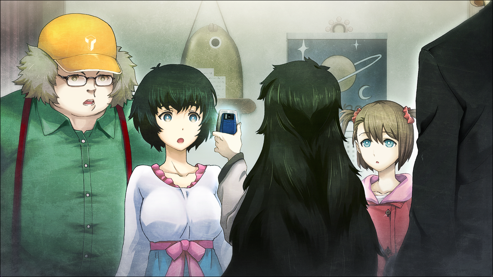

> <big> **轨道秩序的日蚀 - 07** </big>  
> 1.064750  
> [ 2011/01/01 ] 新年派对 中。众人和“红莉栖”交谈。  

菲莉丝：“唔喵？茶只有这点吗？”  
看来宴会才开始没多久，茶就已经喝完了。  
铃羽：“都怪哥哥只买了甜果汁回来。”  
桶子：“没有茶的话喝可乐不就好了吗？”  
琉华子：“年菜配碳酸还是有些……”  
“那我和桶子去买回来吧。”  
枫：“啊，就让我和吹雪酱去吧。”  
吹雪：“我也？”  
枫：“我们是被叫来的嘛，这点事还是要做……”  
吹雪：“没办法。那就去一趟吧。随便买就行了吧？”  
“这样吗，不好意思，麻烦了。”  

因为枫和吹雪离席，屋里稍微安静了一下。仿佛是瞄准了这个时机一样，谁的电话响了。  
“对不起，是我的电话。”  
比屋定取出手机确认画面，随即看向我。
“那个，冈部，可以现在连接『Amadeus』吗？”  
“诶？”  
“电话，那孩子打来的。而且，她对这个情景的反应也能成为很好的样本……不行吗？”  
“这……”  
真由理：“那个，真帆小姐真帆小姐，“阿马丢斯”是什么呀？”  
回过神来，“红莉栖”已经挂了电话，取而代之的是所有人都在注意着这边。  
比屋定：“是储存了特定人的记忆的 *Artificial Intelligence* 哦。”  
真由理：“阿提菲秀噜？”  
菲莉丝：“就是AI喵。”  
绹：“ei ai……？”  
菲莉丝：“AI，就是 *Ancient Intelligence*，也就是指古代遗失的伟大智慧喵！”  
比屋定：“都说是 *Artificial Intelligence* 了……”  
桶子：“就是一种能自发思考、学习的程序。但是，拥有特定人记忆的AI……那不就是那人的复制吗？”  
比屋定：“到底那算不算复制，现在我们正在验证中。”  
“那就是『Amadeus』？惊了，你们竟然在做这种东西？”  
真由理：“那个……琉华君，你懂吗？”  
琉华子：“不。我也完全不……”  
比屋定：“能让你们看一下就容易理解了……”  
比屋定瞄了一眼我的脸色。  
“在拍不到我的地方就可以……”  
比屋定：“知道了。”  
比屋定叹着气说道，随后手指伸向了手机的App。  
桶子：“诶？可以用手机启动？”  
比屋定：“虽然本体是在大学的服务器里，我们做了更简便的连接。”  
对这样的技术，桶子双眼放光地盯着画面。  

终于，比屋定的手机里传出那个声音——  
“真是的，前辈，为什么不肯接——哇啊！”  
“喔哦哦哦，好强！”  
“诶？不是……前辈？是……谁？”  
“我吗？我是桥田至，如果你想也可以叫我前辈哦。可以的话，最好配上红着脸往上看的眼神。”  
“为、为什么我非要叫见都没见过的你为前辈啊？你到底是——”  
“‘红莉栖’抱歉吓了你一跳。”  
“啊，真帆前辈……刚才的人是……”  
“他叫桥田至，冈部先生的好朋友。今天不是新年吗，所以在冈部先生的LAB和他的朋友们一起开派对。”  
“啊啊，那个冷淡的冈部先生啊。前辈也不要和那个人来往太多为好，不然什么时候被抛弃都不知道。”  
“好啦好啦……”  
这话中带的刺……看来相当生气。但那也是没办法的。  
“那么我来介绍一下，她是有着我的后辈——牧濑红莉栖记忆和人格的AI——『Amadeus』”  
“诶，牧濑红莉栖是——”  
“难不成，是那位？”  
桥田父女一起反应了过来。是的……这两个人知道红莉栖的存在，也知道她发生了什么——  
“牧濑红莉栖，没记错是半年前在广播会馆……”  
“啊……”  
“牧濑……红莉栖……这位就是……”  
菲莉丝，琉华子和真由理只是了解这条世界线上的红莉栖发生事故的事情。
“啊，难道各位知道我本体的事吗？”  
“啊，不……嗯，怎么说呢……”  
“不用担心。我也知道本体的自己发生了什么。”  
“啊、是、是……吗？”  
桶子本来在绞尽脑汁怎么糊弄过去，反而被当事‘人’安慰了。虽然这么说，要不在意才是强人所难吧。  
“那个，这是游戏吗？”  
似乎这里只有綯不清楚事情原委，而这在此时尤其宝贵。因为她的一句话，僵硬的空气缓和了下来。  
“呵呵，不是游戏哦。我是AI，和你一样，通过自己的思考在说话。”  
“这么说……是真正的AI喵？太厉害了喵！”  
“厉害的是制作了我的真帆前辈。”  
大家都紧盯着手机中自由变换着表情，回答着问题的“红莉栖”。这时我开始后悔了，不该让“红莉栖”在这里说话的，不该这样让LAB的大家想起“红莉栖”的存在。果然还是应该马上断掉和“红莉栖”的通话。  
“比屋定小姐——”  
“诶？”  
在我发声的同时，比屋定发出了惊讶的声音。  
“怎么了哦？”  
“『Amadeus』突然不见了。”  
“App崩了吧？这种事也常有。”  
“可能是……但是再次启动后也连不上服务器。”  
“不是服务器的数据更新吗？”  
“我没听说要更新啊。”  
“这里的网好像没断喵。”  
桶子正从专业角度给出自己的猜测，菲莉丝则用手机联网确认。  
“好奇怪。至今没有过这样的情况。那个，冈部先生。你那边能试一下嘛？”  
“不，我——”  
因为我肯定被“红莉栖”讨厌了——才想这么说，就响起了硬物碎掉的声音。  
“对、对不起……”  
似乎是篝弄掉了杯子，玻璃碎了一地。  
“姐姐你没事吧？脸色很差啊。”  
“嗯……谢谢。可能有点累了……啊，不过没事的……不好意思，我马上收拾……”  
“啊、篝你不用动。我来收——”  
就在琉华子要去拿扫除工具时，陌生的声音从门口响起。  
“不许动！”  

 

> (to be continued)
---

| [←prev](./0068) | [home](../../) | [next→](./0070) |
