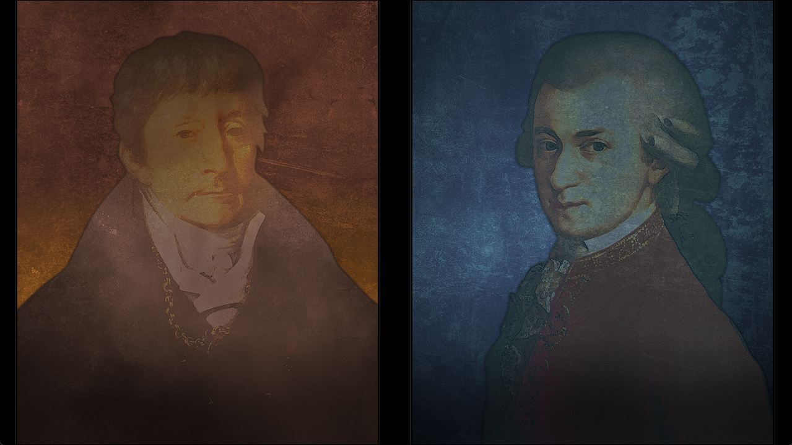

> <big> ** 存在证明的自动机械 - 00** </big>  
> 1.081163  
> [ 2011/01/02 ] 接0073 - 再想一下。真帆的内心独白。阿马德乌斯和萨列里；红莉栖和我自己；这两组对我而言是具有特别意义的对应。  

*Amadeus* 和 *Salieri*；  

红莉栖和我自己；  
这两组对我而言是具有特别意义的对应。  

沃尔夫冈·阿马德乌斯·莫扎特，无人不识、举世认同的天才音乐家。受洗时的全名是<abbr title="Joannes·Chrysostomus·Wolfgangus·Theophilus·Mozart">约翰内斯·克里斯托斯·沃尔夫冈格斯·特奥菲勒斯·莫扎特</abbr>，其中的特奥菲勒斯（Theophilus）来自希腊文，意为“天主之爱”。莫扎特很喜欢这个词的含义，于是取了拉丁文中的同义的阿马德乌斯（Amadeus）作为自己在公共场合的正式名字。他在那段短暂的、就其绝世才华而言堪称悲剧性的35年音乐生涯中，留下了超过600部传世之作。阿马德乌斯，名副其实地被神眷顾着，拥有与生俱来的天赋，因此成为了特别的存在。  
我却，不那么想。无可否认他是一个天才。但同时，阿马德乌斯也一定付出了他的努力与辛劳。不管是多么完美无瑕的天生原石，不经过磨砺也无法成为珍宝。将他的功绩全部归功于他的天赋的话，是在侮辱他自身的那份努力与付出。但是，换个角度讲，想要达到莫扎特那般境界，是不是也需要天生就拥有跟他同样等级的原石才可以呢？  
这个世界上，拥有这种原石的人很多。牧濑红莉栖——对我而言，牧濑红莉栖就是这样的人。只要看到她的那份气质，就能感受到她的才华。从她的思想中源源不断地溢出的种种想法，总是那么地令人激动。能够跟她一起做研究，我感到很骄傲。  
然而，我并不知道，对她来说我又是怎样的存在。不好意思一本正经地去问，一直想着等时机合适顺便问看就好了。可是，2010年7月28日，牧濑红莉栖去世了。我永远没有机会知道，对她来说我是怎样的存在了。  
沃尔夫冈·阿马德乌斯·莫扎特生前，他的身边生活着一位，一直被认为是他一生宿敌的人。那个人的名字是，安东尼奥·萨列里。维克多·孔多利亚大学的校内网上，我的用户名——“Salieri”，就是取自他的名字。红莉栖去世数周之后，研究所的网络系统更新，我就改成了这个名字。只是为了对应和生前的红莉栖一起开发的、现在也在继续研究的软件的名字，没有更多的含义了。这个软件的名字是『Amadeus』。为这个神经网络型人工智能赋予了天才音乐家的名字的，就是雷斯吉宁教授。当时的我，认为这个命名非常贴切，现在的我也是这么想的……是、这么想的。  
阿马德乌斯和萨列里；  
红莉栖和我自己；  
这两组对我而言是具有特别意义的对应。  
我，非常喜欢牧濑红莉栖；  
我，敬佩着红莉栖；  
我，憧憬着红莉栖；”  
我……  
我——”  

 

> (to be continued)
---

| [←prev](./0073) | [home](../../) | [next→](./0075) |
