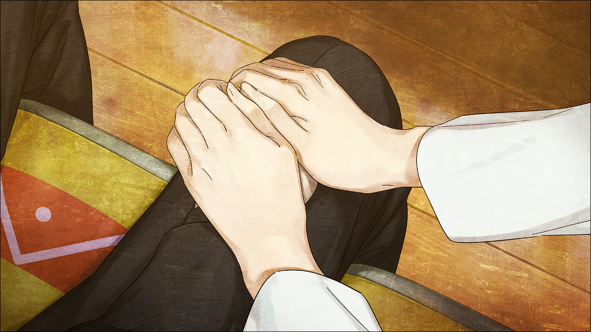
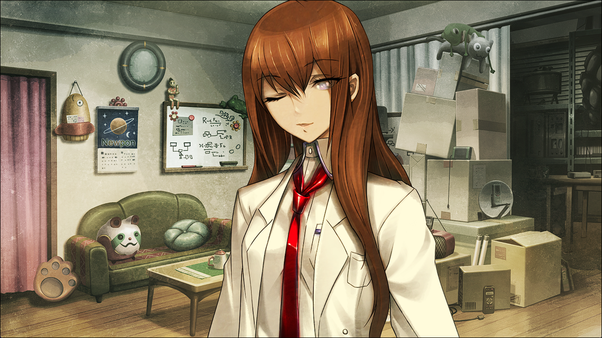

> <big> **二律背反的双模 - 01** </big>  
> 0.571082  
> [ 2011/01/02 ] 回到了α世界线，见到了活着的红莉栖。

……  
…………  
………………  
逐渐从黑暗的底部浮上来的感觉。朦胧的意识一点点地清晰。  
“这里……是……？”  
我以缓慢的动作观察着周围。没有错，这里是未来机械研究所——到刚才为止我一直呆的地方。四周一切如常，只是——大家的身影都消失了。到刚才为止大家都还在四周，可现在室内空无一人。我确认了时间。刚才和比屋定通话结束，大概是下午3点左右。在那之后只经过了几分钟。就算我突然失去了意识，仅仅这么短的时间，所有人就从这里消失也不太可能……  
我慢慢地在室内来回走动，另外发现了一些奇怪的地方。桶子一直用的电脑，键盘上积着薄薄一层灰，就像是有一段时间没有人使用了一样。然后还有房间的角落，如果是平常的话，真由理的纸袋会放在那里，装着做好的cos服之类的。到刚才为止那里确实放着纸袋的，不知什么时候也不见了。难道是……  
“世界线……又变了……？”  
但是，为什么？说起来……刚才“红莉栖”的话——为什么“红莉栖”会让我救她？和世界线变动有关系吗？为了确定这一点，我从口袋里拿出手机想要打开『Amadeus』——但手指停住了。  
“消失了……”  
手机上没有了『Amadeus』的图标。  
（什么情况……这是……？）  
在脑内拼命地回想到底发生了什么，但根本就不可能想出答案。  
（冷静……总之先确认一下状况。）”  
正打算走向门的时候——房间的里面，现在本应该不怎么使用了的开发室里面传出了声音。有人在那里？是谁？桶子吗？真由理吗？我慢慢地靠近。  
“…………！”  
呼吸——像要停止一样。忘不了。不可能忘记的身影。  
在那里站着的是——  
牧濑红莉栖。  

红莉栖背对我坐在桌前，低着头，好像在盯着什么东西看。不可能……红莉栖不可能在这里。因为，她已经……她已经死了。难道是我看到了幻象吗？是想见红莉栖的心意，诞生了她的幻象吗？但就算是幻象，这身姿也太真实了。即便如此，感觉好像一出声她就会立刻消失一样。我连话都说不出来。红莉栖身体一动不动，到底是在看着什么呢？正当我觉得眼前完全静止的身影果然是幻觉的时候，红莉栖终于稍稍呼了口气，然后慢慢地站起身转了过来。  

“啊！……冈部？”  
“啊……”  
喉咙干枯得发不出声音。  
“既然来了就说一声啊！静静站在那里吓我一跳。”  
“…………”  
“新年快乐。”  
“诶？啊……”  
“不过很难得呢，你会在这里露面。”  
“……”  
“冈部……？”  
“红莉…栖……”  
“……？”  
“红莉栖……真的是你吗……？”  
“大新年的，你在说什么呢？没事吧？吃坏东西了吗？”  
无论是她这副不太开心的表情——  
“红莉栖……”  
“什么？”  
还是她那偶尔露出的温柔目光——  
“怎么了啊？真的没事吗——”  
还有她那——
“呀！”  
还有这份温暖也是——  
“喂！你、你、你……突然间这是——”  
不是什么幻象。也不是画面中的人工智能。这是真正的——牧濑红莉栖。  
“冈部……？”  
是活着的红莉栖。  
“呜呜呜呜……”  
“呐，冈部……拜托，先放开……”  
“对不起……但是……让我这样，再多抱一会儿……”  
“……你难道……是在哭吗？”  
这才发现，自己的脸颊已经濡湿。  
“……”  
背上传来了她双手抚摸的温柔触感。  
“不要担心……已经没事了……”  
“红莉栖……”  
“没事的哦……没事的……”  
伴随着轻声细语，红莉栖不断安抚着我的后背。她也把我拥入怀中，就像慈祥的母亲，在哄孩子一样。  

“对不起……”  
我勉强重归冷静，两人面向对方。眼前的红莉栖，依然没有消失，好好地存在于这世间。冷静下来的我开始注意到，这到底意味着什么。  
“没事……别在意……这也是没办法的。我也有时候也会这样……”  
“也这样？”
“你是回想起了……真由理的事吧？”  
是了，红莉栖还在这里。也就是说，这里是α世界线。是没有真由理的世界。真由理已经死去的世界。原本还稍稍抱有期待，也许这就是命运石之门的彼端，某处的某人帮我打开了向着崭新未来的大门什么的。但是，没有这么便宜的事情。到底发生了什么，我至今还不清楚。但是，这里的我应该早已做出了选择——放弃真由理。这就是放弃真由理所到达的现在。  
“唔……”  
真由理的死亡又一次被摆在了眼前。事到如今，我的心脏仍然像是要被捏碎一般在悲鸣。  
“真由……理……”  
这里的真由理是怎么死的？  
“啊……啊……”  
“冈部？”  
从站台被推下轨道吗？  
“哈啊……哈啊……哈啊……”  
被枪杀吗？  
“啊……哈啊、哈啊……哈啊……”
还是——  
“冷静下来！”  
红莉栖用她纤弱的手指，包住了我颤抖的双手。  
“好吗？来，做个深呼吸……”  
“哈啊啊……”  
空气终于被吸入身体，狂跳的心脏逐渐平复了。  

“对不起，是我说了多余的话……”  
“不……不是的……不是……”  
“……要吃点药吗？我去拿水过来。”  
在自己衣服的口袋里掏了一会儿，拿出了一个小小的药盒。和我一直在吃的药一样，精神安定剂。结果，就算是在这个世界，我好像也是在依靠精神安定剂的样子。在红莉栖为我倒水的时候，我环顾屋内。  
“呐……冈部，为什么……为什么来了这里？”  
“诶？”  
“你不是一直都不愿意靠近这里吗？桥田也都不过来了。”  
“桶子也？”  
“嗯……”  
即使如此，屋内还是保持着整洁。仔细看了一下，除了桶子的电脑之类的积了不少灰尘之外，其他地方都有在定期打扫。  
“红莉栖……你常来这里吗？”  
“时不时呢。不然的话，会很寂寞的。”  
谁会寂寞？即使没说出来，我也明白的。真由理很喜欢这里，这个未来机械研究所。她超喜欢和LABMem的大家一起度过的时光。  
“对不起……”  
“为什么要道歉？”  
“因为……”  
等了一会，她还是没有说出后面的答案。红莉栖为什么要道歉？因为提到了真由理吗？因为让我又回忆起真由理吗？还是说——因为，让我做出了那样的选择吗？  
“红莉栖……”  
“什么？”  
“不，没什么。”  
“嗯。”  
叫她就会得到回应，伸出手就能碰到她。只是如此简单的事情，都会让我哭出来。若能就这样下去——  
“唔……”  
我到底在想什么啊！我可是曾经，放弃全部，眼看着红莉栖被杀的男人啊！但是这样的我，却为再次到达这条世界线，能和红莉栖再会而感到如此高兴。在悲伤着又一次失去真由理的同时，却想着这样的时间能一直持续下去就好了。明明我没有这样的资格。如果这个世界上有神存在的话，那么那肯定是性格扭曲而残酷的家伙。为何事到如今，要让我再遭遇这种事情。难道我的罪孽如此深重吗？明明应该已经做过决定了。我拯救不了世界，救不了红莉栖。然而——当红莉栖站在我面前的时候，我确实动摇了。是不是应该再一次回到β世界线？是不是应该发送D-mail？  
D-mail？  
“说起来，电话微波炉（暂定）怎么样了？”  
“诶？怎么样了……你破坏的，忘了吗？”  
“啊……这样啊……”  
看来，电话微波炉（暂定）在这个世界已经不存在了。想想也是当然的，因为只要有那东西存在，我们就会成为SERN的目标。但是没有电话微波炉（暂定）的话，就意味着没有办法凭借我的意愿，从这个世界线中脱离出去。这样的话，即使留在这条世界线，也不是我的错。这既不是我的责任，也不是因为我的期望造成的。既然如此——  

“呐，冈部。”  
“嗯？”  
“……”  
“……”  
“虽然很不好意思，你能去买点喝的回来吗？”  
“喝的？”  
“喉咙有点干呢。可以的话能买些热饮回来吗？”  
“速溶咖啡的话，我现在就能做。”  
说起来，平时不都是我一直做给她喝的吗？两颗方糖，不加奶。  
“咖啡……已经没有了呢。”  
“……知道了。”  
这样的话，就跑一趟吧。正好出去走走，整理一下大脑。  
“要买加牛奶和砂糖的，很甜那种哦~”  
“以前不是不加奶的吗？”  
“天冷了，想多喝点甜的东西。”  
“明白了。”  
起身走向大门，途中又转过头来。  
“……”  
“怎么了？”  
“没……”  
感觉好像目光一离开，你就会消失——但是，果然太难为情了还是没说出口。  
“冈部。”  
“嗯？”  
“振作点哦~”  
“又不是小孩了，跑点腿总能做到的。”  
“嗯，也是呢。路上小心~”  

 

> (to be continued)
---

| [←prev](./0073) | [home](../../) | [next→](./0075) |
